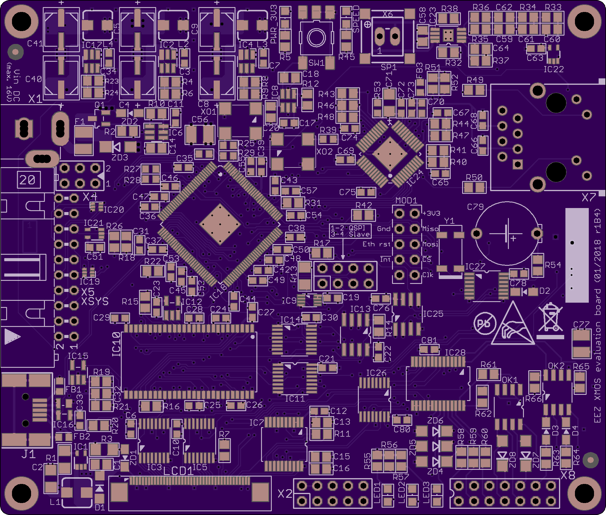

### Ownership and License

The contributors are listed in CONTRIB.TXT. This project uses the TAPR v1.0 license, see LICENSE.TXT.
EEZ _xmos-eval-board_ uses the [C4.1 (Collective Code Construction Contract)](http://rfc.zeromq.org/spec:22) process for contributions.
To report an issue, use the [issue tracker](https://github.com/eez-open/xmos-eval-board/issues).

### Overview

This project is an attempt to learn more about [XMOS xCORE-200](http://www.xmos.com/products/silicon/xcore-200) multicore microcontroller XE216-512-TQ128 by making evaluation board that would be used as a prototype or building block in some future DIY open source Test & Measurement (T&M) projects.
Selected MCU has 16 _logical_ cores divided between two hardware cores (_tiles_)and include USB 2.0 and [RGMII](https://en.wikipedia.org/wiki/Media-independent_interface) for Gigabit Ethernet. It has the highest pin count that comes in easy to mounting package (not BGA).
The evaluation board is based on XMOS evaluation boards and a couple of so-called _sliceCARDs_.

Evaluation board features:

- PCB dimension: 100 x 85 mm
- Power supply: 12 Vdc with on board regulators for 1 V, 3.3 V (sequenced) and 5 V (for USB host)
- XSYS 20-pin IDC connector for JTAG and real-time debugging (via 2-wire _xlink0_) with ESD protection
- USB AB-mini 5-pin plug with ESD protection (hopefully can be used for [OTG](https://en.wikipedia.org/wiki/USB_On-The-Go) operation)
- Support for RGB 4.3" LCD TFT (40-pin FFC 0.5 mm), 16-bit color space supported
- LCD WLED power supply with brightness control (PWM)
- Resistive touch screen controller (SPI)
- QSPI Flash memory
- 10-pin IDC connector for direct access to Flash memory
- 16-bit I/O port expander with 2 opto-isolated input, 2 opto-isolated outputs, 3 on-board LEDs, 3 TVS protected inputs
- Real time clock (SPI) with supercap backup (Vbat)
- EEPROM (SPI)
- SDRAM (multiplexed address and data bus)
- 20-pin FFC 0.5 mm socket for Riverdi LCD TFT displays (SPI, Audio out)
- Micro SD Card socket (SPI)
- 10/100 Mbit Ethernet PHY with RJ-45 socket
- Low-power audio amplifier
- 10-pin header for cheap W5500 Ethernet module (SPI)
- Reset switch

For MCU pin mapping check _[Portmap for EEZ evaluation board](XE216-512-TQ128_portmap_for_EEZ_evaluation_board_r1B4.pdf)_

